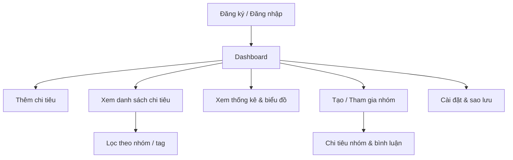

# SpendMate - App Quản Lý Chi Tiêu

## 1. Tổng quan

**Tên app:** SpendMate (tạm thời)

**Mục tiêu:** Hỗ trợ người dùng quản lý chi tiêu cá nhân và nhóm, theo dõi dòng tiền, lập kế hoạch tài chính, chia sẻ dữ liệu giữa gia đình, bạn bè hoặc nhóm làm việc.

**Nền tảng:** iOS, Android, PC (Windows/macOS)

**Công nghệ gợi ý:**

* Cross-platform: Flutter hoặc React Native + Electron
* Backend: Node.js + Express hoặc Python FastAPI
* Database: PostgreSQL hoặc Firebase Firestore
* Cloud: Firebase/AWS S3 cho hình ảnh, Push Notification
* Bảo mật: OAuth2, JWT, mã hóa AES cho dữ liệu nhạy cảm

## 2. Tính năng chính

### A. Tài khoản & đăng nhập

* Đăng ký: Email, số điện thoại, Google/Facebook/Apple ID
* Đăng nhập và xác thực 2 lớp (2FA)
* Quản lý thông tin cá nhân, mật khẩu, avatar

### B. Quản lý chi tiêu

* Thêm chi tiêu: số tiền, loại chi tiêu, ghi chú, hình ảnh hóa đơn
* Phân nhóm chi tiêu: nhóm sẵn có và nhóm tùy chỉnh
* Quản lý thu nhập: lương, thưởng, thu nhập khác

### C. Thống kê & báo cáo

* Thống kê theo: ngày, tuần, tháng, năm
* Biểu đồ trực quan: Pie chart, Line chart, Bar chart
* So sánh chi tiêu: tháng này vs tháng trước, năm nay vs năm trước
* Xu hướng & dự báo chi tiêu dựa trên dữ liệu quá khứ

### D. Chia sẻ & group

* Tạo nhóm gia đình/nhóm bạn
* Quyền: Admin / Member
* Ghi chú, bình luận chi tiêu chung
* Chia sẻ báo cáo tổng hợp hoặc chi tiết

### E. Thông báo & nhắc nhở

* Nhắc nhở chi tiêu định kỳ (ví dụ: trả tiền điện, nước)
* Cảnh báo khi vượt ngân sách

### F. Bảo mật & sao lưu

* Sao lưu cloud và đồng bộ đa thiết bị
* Mã hóa dữ liệu người dùng

## 3. Requirement chi tiết

| Loại           | Yêu cầu                                       |
| -------------- | --------------------------------------------- |
| Functional     | Đăng ký, đăng nhập, quản lý tài khoản         |
| Functional     | Thêm, sửa, xóa chi tiêu                       |
| Functional     | Tạo nhóm chi tiêu, nhóm người dùng            |
| Functional     | Thống kê theo ngày/tháng/năm                  |
| Functional     | Xuất báo cáo PDF/Excel                        |
| Functional     | Chia sẻ nhóm, bình luận chi tiêu              |
| Non-functional | Cross-platform (iOS, Android, Windows, macOS) |
| Non-functional | Offline mode → sync khi có mạng               |
| Non-functional | Bảo mật dữ liệu và xác thực 2FA               |
| Non-functional | Dễ dàng mở rộng nhóm, phân loại chi tiêu      |

## 4. UI/UX Concept

### 4.1 Dashboard

* Tổng chi tiêu/tháng
* Biểu đồ phân loại chi tiêu
* Nút thêm nhanh "+ Chi tiêu"

### 4.2 Trang Chi tiêu

* Danh sách chi tiêu theo ngày/tuần
* Lọc theo nhóm, tag, người nhập

### 4.3 Trang Thống kê

* Biểu đồ tương tác: Pie chart, Bar chart
* Xu hướng chi tiêu theo thời gian

### 4.4 Trang Nhóm/Gia đình

* Danh sách thành viên
* Chi tiêu chung, bình luận, ghi chú

### 4.5 Trang Cài đặt

* Quản lý tài khoản, ngân sách, nhắc nhở, sao lưu & đồng bộ

## 5. Luồng người dùng (User Flow)

