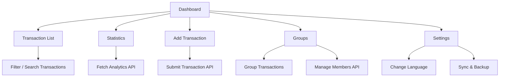

# SpendMate - Mobile App Design

## 1. Nền tảng
- iOS và Android
- Cross-platform: Flutter hoặc React Native
- Responsive với nhiều kích thước màn hình

## 2. Màn hình chính

### 2.1 Đăng ký / Đăng nhập
- Form email/số điện thoại, mật khẩu
- Social login: Google, Apple, Facebook
- Quên mật khẩu
- Ngôn ngữ hiển thị theo setting người dùng
- Wireframe: notch, status bar, layout đơn giản, rõ ràng

### 2.2 Dashboard
- Thẻ tổng quan: Tổng số dư, Tổng thu, Tổng chi
- Biểu đồ phân nhóm chi tiêu (Pie chart)
- Giao dịch gần đây
- Nút nổi "+ Chi tiêu" (Floating Action Button)
- Hiển thị thông tin cá nhân: tên, avatar
- Ngôn ngữ theo setting

### 2.3 Thêm giao dịch
- Loại: Thu / Chi
- Số tiền, danh mục, ngày, ghi chú
- Tải hình ảnh hóa đơn (tùy chọn)
- Nút Lưu
- Wireframe: form gọn, chú thích icon cho từng trường

### 2.4 Thống kê
- Biểu đồ cột theo tháng, biểu đồ đường xu hướng
- Lọc theo Ngày / Tháng / Năm
- Chi tiêu theo danh mục (progress bar)
- Xu hướng và so sánh tháng trước, năm trước

### 2.5 Nhóm / Gia đình
- Danh sách nhóm và thành viên
- Vai trò: Admin / Member
- Chi tiêu chung, nhật ký, ghi chú, bình luận
- Thêm / mời thành viên
- Ngân sách nhóm, % sử dụng

### 2.6 Cài đặt
- Quản lý thông tin cá nhân, avatar, mật khẩu
- Cài đặt ngôn ngữ, đồng bộ dữ liệu
- Thông báo & nhắc nhở
- Backup và restore dữ liệu từ cloud

## 3. UI/UX Guidelines
- Phong cách: sạch, hiện đại, đơn giản, dễ đọc
- Chủ đề màu: nền sáng, tông xám-trắng, điểm nhấn xanh nhẹ
- Typography: sans-serif, rõ ràng, dễ đọc
- Icons: trực quan, gợi nhớ chức năng
- Tương tác: swipe, tap, long press, floating button cho thao tác nhanh
- Ngôn ngữ hiển thị theo setting người dùng (vi, en,...) với khả năng mở rộng
- Hỗ trợ Dark mode (tuỳ chọn nâng cấp sau)

## 4. Navigation
- Bottom Navigation Bar: Dashboard, Giao dịch, + (floating), Thống kê, Nhóm
- Stack navigation cho chi tiết và form (push/pop)
- Drawer menu (tuỳ chọn) cho cài đặt và logout

## 5. Data Flow

