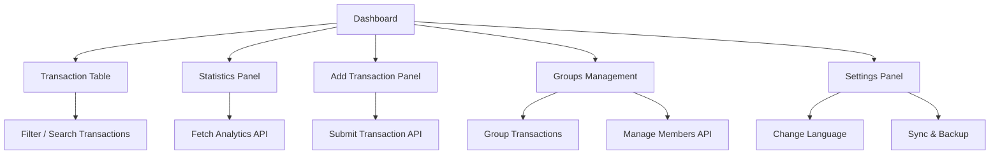

# SpendMate - PC/Desktop App Design

## 1. Nền tảng
- Windows và macOS
- Cross-platform: Electron hoặc Flutter Desktop
- Responsive với các độ phân giải màn hình khác nhau

## 2. Màn hình chính

### 2.1 Dashboard Desktop
- Thanh menu bên trái: Dashboard, Giao dịch, Thống kê, Nhóm, Ngân sách, Cài đặt
- Thẻ tổng quan: Tổng số dư, Tổng thu, Tổng chi, Tiết kiệm
- Biểu đồ lớn: Thu - Chi theo tháng, xu hướng thu-chi (line chart)
- Phân bổ chi tiêu theo danh mục (donut chart)
- Bảng giao dịch gần đây
- Thao tác nhanh: Thêm giao dịch, Chuyển khoản, Quét hóa đơn, Báo cáo
- Ngôn ngữ theo setting người dùng

### 2.2 Giao dịch / Transaction List
- Bảng chi tiết: Ngày, Mô tả, Danh mục, Loại, Số tiền, Phương thức, Ghi chú
- Lọc, tìm kiếm, sắp xếp theo ngày, danh mục, nhóm, người tạo
- Hỗ trợ export CSV/PDF

### 2.3 Thêm giao dịch / Add Transaction
- Loại: Thu / Chi
- Số tiền, Danh mục, Ngày, Ghi chú
- Tải hình ảnh hóa đơn (tùy chọn)
- Nút Lưu
- Giao diện tương tự mobile nhưng rộng rãi, dễ thao tác chuột và bàn phím

### 2.4 Thống kê / Analytics
- Biểu đồ cột theo tháng, biểu đồ đường xu hướng
- Chi tiêu theo danh mục (progress bar / chart)
- Xu hướng, so sánh tháng trước, năm trước
- Lọc thời gian: ngày, tháng, năm

### 2.5 Nhóm / Group Management
- Danh sách nhóm, thành viên, vai trò (Admin/Member)
- Chi tiêu chung, nhật ký, ghi chú, bình luận
- Thêm / mời thành viên
- Ngân sách nhóm, % sử dụng

### 2.6 Cài đặt / Settings
- Quản lý thông tin cá nhân, avatar, mật khẩu
- Cài đặt ngôn ngữ, đồng bộ dữ liệu
- Thông báo & nhắc nhở
- Backup & restore dữ liệu từ cloud

## 3. UI/UX Guidelines
- Phong cách: sạch, hiện đại, đơn giản, dễ đọc
- Chủ đề màu: nền sáng, tông xám-trắng, điểm nhấn xanh nhẹ
- Typography: sans-serif, rõ ràng, dễ đọc
- Icons: trực quan, gợi nhớ chức năng
- Tương tác chuột & bàn phím: hover, click, drag & drop
- Ngôn ngữ hiển thị theo setting người dùng
- Hỗ trợ Dark mode (tuỳ chọn nâng cấp sau)

## 4. Navigation
- Thanh menu bên trái cho các module chính
- Top bar: thông tin người dùng, chọn ngôn ngữ, thông báo
- Main panel hiển thị nội dung tương ứng với module
- Breadcrumbs cho chi tiết giao dịch / nhóm

## 5. Data Flow

